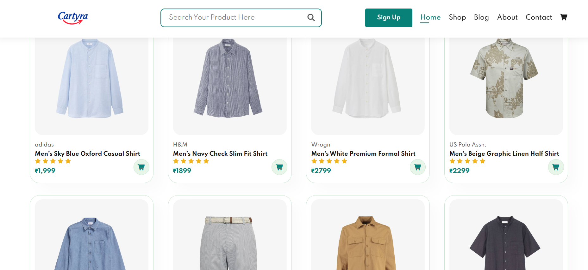

# 🛒 Cartyra — Buy Products Online

> A modern, responsive e-commerce frontend website built with HTML, CSS, and Vanilla JavaScript.

---

## 📌 About The Project

**Cartyra** is a fully responsive multi-page e-commerce website designed for online clothing and fashion shopping. It features a clean, modern UI with smooth interactions, a working shopping cart, coupon system, and a complete set of pages including Home, Shop, Blog, About, Contact, and more.

Built as a frontend project to demonstrate real-world web development skills using only HTML, CSS, and JavaScript — no frameworks required.

---

## 🌐 Live Pages

| Page | File | Description |
|------|------|-------------|
| Home | `index.html` | Hero banner, featured products, new arrivals, banners |
| Shop | `shop.html` | Full product listing with pagination |
| Single Product | `sproduct.html` | Product detail view with image switcher |
| Cart | `cart.html` | Shopping cart |Product Quantity increase/Decrease ,Remove
| Blog | `blog.html` | Fashion blog posts |
| About | `about.html` | Brand story, app promo video |
| Contact | `contact.html` | Contact form, map, team details |
| Login | `login.html` | Sign in form with links to register |
| Register | `register.html` | Register form with links to login |

---

## ✨ Features

- **📱 Fully Responsive Design**: Mobile, tablet, and desktop layout compatibility with a sticky navigation header and slide-in sidebar menu.
- **🛒 Dynamic Shopping Cart**: Client-side state persistence using `localStorage`. Quick-add items directly from product cards or customize order sizes and quantities from the details page.
- **🎨 Dynamic Details Page (`sproduct.html`)**: Product cards link dynamically using URL parameters (`?id=ID`) to look up products in a localized javascript database and update main/gallery images, descriptions, categories (`Home / Men` vs. `Home / Women`), and select elements.
- **🌈 Size & Color Selector**: Allows choosing specific sizes (S, M, L, XL, XXL) and color configurations before adding to the cart, automatically grouping identical selections.
- **🏷️ Navbar Cart Badges**: Responsive badge counts display on both mobile and desktop bag icons indicating total cart quantities with modern bump animation alerts.
- **🎟️ Coupon discount system**: Supports application of discount promo codes (`SAVE10` for 10% off and `CARTYRA20` for 20% off) updating order summaries in real-time.
- **🔍 Sitewide Search Engine**: Intercepts search form inputs from the header of any page to filter products dynamically on the Shop page, displaying search count banners, clear search triggers, and a custom empty state message if no products match.
- **📝 User Registration workflow**: Cohesive register page (`register.html`) styled after the dark login wrapper with client-side password matching, mock submit handling, and redirect.
- **🔔 Premium custom alerts**: Toast notification overlays for system feedback (e.g. success, info, warnings) without using browser alerts.
- **🎥 Autoplay Media & Maps API**: Auto-plays product video on About page and maps search coordinate mapping on the Contact page.

---

## 🗂️ Project Structure

```
cartyra-website/
│
├── index.html          # Home page
├── shop.html           # Shop / all products
├── sproduct.html       # Single product detail
├── cart.html           # Shopping cart
├── blog.html           # Blog page
├── about.html          # About us page
├── contact.html        # Contact page
├── login.html          # Login page
├── style.css           # Global stylesheet
├── script.js           # JavaScript (navbar, image switcher, cart logic)
│
└── img/
    ├── products/       # Product images (f1–f8, n1–n8)
    ├── blog/           # Blog post images
    ├── banner/         # Banner background images
    ├── features/       # Feature icon images
    ├── about/          # About page images & video
    ├── people/         # Contact team photos
    ├── pay/            # Payment & app store badges
    ├── CartyraLogo.png
    ├── Cartyra.png
    ├── HeadLogo.jpeg
    └── HERO.jpg
```

---

## 🛠️ Built With

- **HTML5** — Semantic structure
- **CSS3** — Custom styling, Flexbox, Media Queries, Animations
- **JavaScript (ES6)** — DOM manipulation, event handling, cart logic
- **Font Awesome 7** — Icons via CDN
- **Google Fonts** — Spartan font family
- **Google Maps Embed API** — Contact page map

---

## 🚀 Getting Started

No installation needed. Just clone and open in your browser.

### Clone the repository

```bash
git clone https://github.com/Pratick-Script/cartyra-website.git
```

### Open in browser

```bash
cd cartyra-website
# Simply open index.html in any browser
```

Or use the **Live Server** extension in VS Code for the best experience:
1. Install the **Live Server** extension in VS Code
2. Right-click `index.html` → **Open with Live Server**

---


---

## 📱 Responsive Breakpoints

| Breakpoint | Target |
|------------|--------|
| `> 799px` | Desktop / Laptop |
| `≤ 799px` | Tablets |
| `≤ 477px` | Mobile phones |

---

## 📸 Screenshots


> 

```
Home Page       →  index.html
Shop Page       →  shop.html
Cart Page       →  cart.html
Contact Page    →  contact.html
```

---

## 👤 Author

**Pratick Majhi**

- 📸 Instagram: [@myself_pratick](https://www.instagram.com/myself_pratick/)
- 📘 Facebook: [pratik.majhi.98](https://www.facebook.com/pratik.majhi.98)
- 🎵 YouTube: [@8amlofi](https://www.youtube.com/@8amlofi)
- 📧 Email: support@cartyra.com

---

## 📄 License

This project is for educational and portfolio purposes.
© 2026 Cartyra. All Rights Reserved.

---

> *Designed & Developed with ❤️ by Pratick Majhi*
